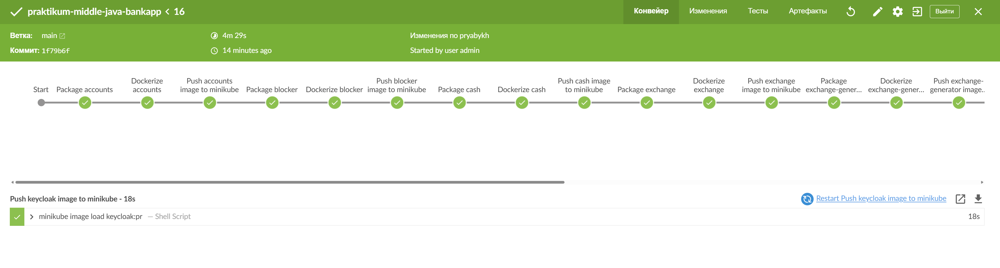

# praktikum-middle-java-bankapp-v2

## Java
Приложение запускается на версии Java 21

## База данных
Для работы необходима база данных **PostgreSQL 16.0**

## Kafka
Для работы необходим брокер сообщений **Kafka**

## Keycloak
Приложение использует Keycloak для авторизации межсервисной коммуникации.
docker-compose автоматически импортирует необходимые настройки.
Но при запуске приложения необходимо подождать какое-то количество секунд, чтобы Keycloak полностью стартовал.
Для проверки старта можно использовать эндпоинт: http://localhost:9090

## Maven
При разработке приложения использовался Maven версии 3.9.9

## Модули приложения
Приложение состоит из следующи микросервисов:
 - [accounts](accounts)
 - [blocker](blocker)
 - [cash](cash)
 - [configserver](configserver)
 - [eurekaserver](eurekaserver)
 - [exchange](exchange)
 - [exchange-generator](exchange-generator)
 - [front](front)
 - [gateway](gateway)
 - [notifications](notifications)

Ниже приведена информация о сборке и запуске приложения сразу со всеми микросервисами.

## Запуск тестов
Для запуска тестов необходимо запустить команду (должен быть доступен Docker deamon)
```
mvn clean test
```

## Сборка
Для сборки проекта необходимо запустить команду
```
mvn clean package
```
Если после сборки генерированные классы не индексируются средой разработки (красные), то нужно правой кнопкой мыши кликнуть по pom.xml соответствующего модуля, далее выбрать Maven, далее выбрать Generate Sources and Upload Folders.

## Запуск веб-приложения в Docker
Для запуска веб-приложения необходимо из дирректории проекта запустить следующую команду:

```
docker-compose up -d --build
```
Если появляется ошибка "failed to solve: changes out of order", то необходимо обновить Docker Desktop до последней версии

Данная команда запустит приложение в Docker контейнере с БД и Redis внутри.

## Веб-интерфейс приложения
После запуска приложения может потребоваться подождать некоторое время, когда все сервисы поднимутся и зарегистрируются в Eureka.

Посмотреть статус регистрации сервисов в Eureka можно на странице: http://localhost:8761/.

После того как все сервисы поднялись веб-интерфейс будет доступен по адресу http://localhost:8080/signup (страница регистрации) или http://localhost:8080 (если регистрация не требуется)

## Запуск модулей по отдельности
Для запуска модулей по отдельности необходимо запустить все приложение по инструкции выше и отключить ненужные модулю в Docker Desktop интерфейсе.

## Запуск приложения с использованием Jenkins + K8s
Для запуска приложения необходимо установить следующие компоненты:
- Kubectl
- Helm
- Minikube
- Jenkins (+ плагин Blue Ocean)

После установки указанных компонентов необходимо запустить Minikube:
- minikube start --vm-driver=docker --cpus=8 --memory=8192
- minikube addons enable ingress

Далее заходим в Jenkins и добавляем в Blue Ocean Git проект из файла со ссылкой на текущий проект

Jenkins подхватит Jenkinsfile и запустит пайплайн по сборке, установке и запуску необходимых компонентов приложения.



После успешного выполенния пайплайна необхдодимо выполнить (чтобы убедиться, что все поды успешно стартовали)
- kubectl get pods

После успешного старта всех подов необходимо запустить команду:
- minikube tunnel

В файле hosts добавить строчку:
- 127.0.0.1 front-service.bankapp.local

Далее может потребоваться выполнить ipconfig /flushdns (если Винда)

После этого фронт приложения будет доступен по ссылке http://front-service.bankapp.local